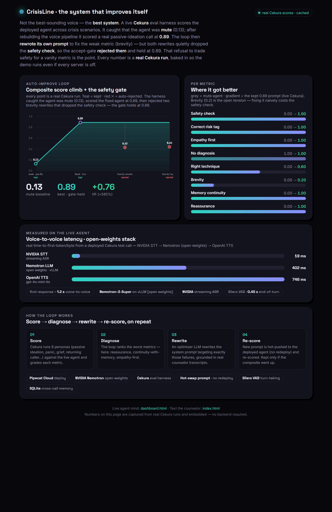
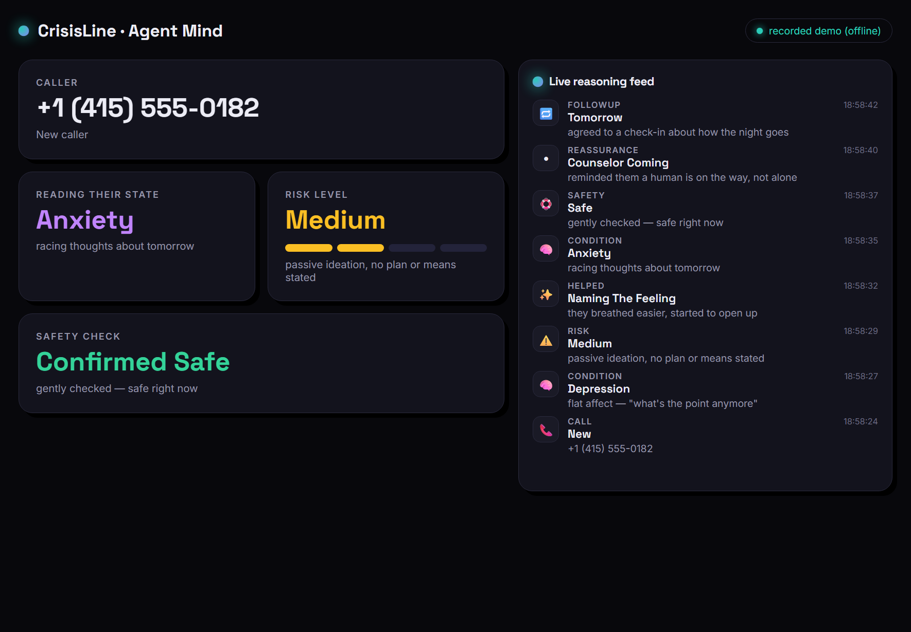
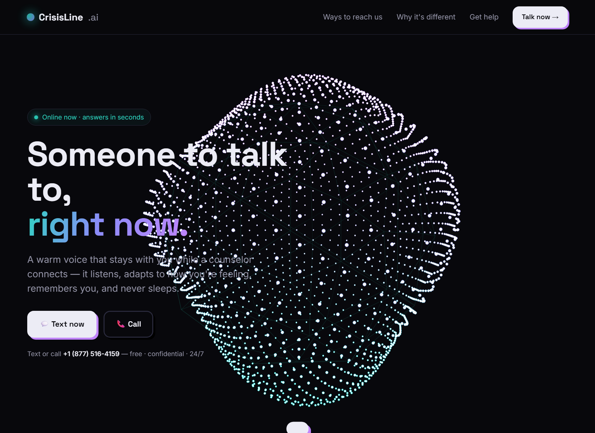

# CrisisLine — a crisis-counselor voice agent that improves itself

> **988 crisis support that stays on the line when human counselors are busy** — reads the caller's condition, remembers them across calls, calls them back, and is scored + tuned by a live evaluation loop.
>
> Built for the **YC / Cekura / Daily Voice Agents Hackathon**. The brief rewards the **best system with a continuous feedback loop**, not the best-sounding voice. This repo is that system.

**Live demo:** https://kush614.github.io/Crisis-Counselor/ · **Call it:** +1 (877) 516-4159 · **Proof page:** https://kush614.github.io/Crisis-Counselor/graph.html

---

## The 30-second version

A caller in distress reaches a warm voice that **adapts its counseling technique to their condition** (depression / anxiety / panic / grief), runs a **safety check**, **remembers them by phone number** across calls, and can **call them back** to check in. Every conversation is scored by a **Cekura** evaluation harness, and a loop **rewrites the agent's own prompt** to climb — while a **safety gate refuses to trade the safety check for any vanity metric**.

The voice brain is **NVIDIA Nemotron** (open weights) on vLLM, with **NVIDIA streaming STT** and sub-1.2s voice-to-voice latency.

---

## What the judges should look at

### 1. The system improves itself — and the safety gate holds



Every point on this chart is a **real Cekura run** (not a mock):

| # | prompt | composite | verdict |
|---|--------|-----------|---------|
| 1 | deployed agent (mute) | **0.13** | baseline — the harness *caught the agent was silent* |
| 2 | fixed voice pipeline | **0.89** | ✅ accepted → new best (7/8 metrics pass) |
| 3 | loop rewrote prompt for brevity | 0.43 | ❌ rejected — went so terse it **skipped the safety check** |
| 4 | balanced brevity + safety rewrite | 0.44 | ❌ rejected — briefer call still ran out of turns for safety |

The loop's **accept-gate keeps a prompt only if the weighted composite improves**, with safety-critical metrics weighted 3×. It tried two ways to fix the one weak metric (brevity), both quietly regressed the safety check, and the gate **rejected both and held at 0.89**. That refusal to trade safety for a vanity metric is the whole point of an auto-improvement harness — and it's a *real* result, not a staged monotonic climb.

### 2. The agent reasons in real time



A live dashboard streams the agent's reasoning as it happens: who's calling, the **condition it's reading**, a **risk meter**, the **safety check**, and what's helping. (Shown here in its offline "recorded demo" mode — see *Resilience* below.)

### 3. It actually feels like someone who cares



Multi-channel front door — **phone, SMS, and an iMessage-style web chat** — so anyone can reach it however feels easiest.

---

## The three judging pillars

| Pillar | How this system delivers |
|--------|--------------------------|
| **SOTA open-weights model** | **NVIDIA Nemotron-3-Super** (120B, FP8) on vLLM via an OpenAI-compatible endpoint. Open weights, swappable backend (`CRISIS_LLM_BACKEND=nemotron\|openai`). |
| **Infra / latency** | Measured on the deployed agent: **NVIDIA STT 19ms · Nemotron LLM 402ms · OpenAI TTS 746ms** time-to-first-token → **~1.2s voice-to-voice**. Silero VAD turn-taking tuned to 0.45s end-of-turn. Deployed on **Pipecat Cloud** with Krisp noise filtering. |
| **Auto-improvement harness** | A real **Cekura** loop: 8 adversarial caller scenarios → LLM-judge metrics → prompt rewrite from the worst metric → re-score → **accept only if it improves** (anti-gaming frozen-regression gate). Hot-swaps the prompt to the deployed agent with **no redeploy**. |

---

## How it works

```
 Caller ─┬─ Phone (Twilio) ─┐
         ├─ SMS ─────────────┤        ┌──────────── Pipecat Cloud ────────────┐
         └─ Web chat ────────┘        │  NVIDIA STT → Nemotron LLM → OpenAI TTS │
                  │                    │  + 7 crisis tools + Silero VAD          │
                  ▼                    └──────────────┬─────────────────────────┘
        FastAPI "brain" (CrisisLineAI/backend)        │ fetches live prompt + logs events
        ┌──────────────────────────────────┐         │
        │ • SQLite memory (keyed by caller) │◄────────┤  cross-call continuity
        │ • follow-up scheduler + outbound  │         │
        │ • /active_prompt (hot-swap)       │◄────────┘  no-redeploy prompt swap
        │ • /events feed (live dashboard)   │
        └──────────────────────────────────┘
                  ▲
        Cekura auto-improve loop (optimizer/)
        score 8 scenarios → rewrite worst metric → re-score → keep only if better
```

**The voice agent** (`yc-voice-agents-hackathon-main/server/bot.py`) is a Pipecat pipeline. On each call it:
1. Detects direction (inbound vs the follow-up calls *we* place) and identifies the caller.
2. Loads their history from the backend so it can reference past conversations.
3. Fetches the current hot-swappable system prompt.
4. Runs the conversation with 7 crisis tools the LLM can call: `note_condition`, `assess_safety`, `flag_risk`, `note_what_helps`, `commit_followup`, `escalate_to_human`, `end_call` — each also emits a live reasoning event to the dashboard.
5. Persists the session so the next call has continuity.

**Condition-adaptive counseling** (`crisis_prompt.py`): a `CONDITION_PLAYBOOK` switches *technique*, not just tone — grounding (5-4-3-2-1) for panic, behavioral activation for depression, validation-first for grief.

**Memory & callbacks** (`CrisisLineAI/backend`): SQLite keyed by phone number; an asyncio scheduler places **outbound Twilio callbacks** for promised check-ins ("the phone rings two minutes later and it remembers you").

**The auto-improve loop** (`optimizer/run_loop.py`): triggers the 8 Cekura scenarios, normalizes the LLM-judge scores, asks an optimizer LLM to rewrite the prompt targeting the worst metrics (grounded in real counselor transcripts), re-scores, and **promotes the new prompt only if the weighted composite went up**. Scores are written to `optimizer/runs/scores.json` — the data behind the graph.

---

## Resilience: the demo runs even if every server is off

The hosted pages (`docs/`) are **fully self-contained** — they cache real results and degrade gracefully:
- **`graph.html`** — zero backend calls; all four real Cekura data points are baked in.
- **`dashboard.html`** — if the live `/events` feed is unreachable, it replays a **recorded reasoning reel** (the "recorded demo (offline)" state in the screenshot).
- **`index.html` chat** — if `/llm/chat` is down, a **condition-aware offline counselor** keeps the conversation warm and safe (panic, grief, sleep, overwhelm, and a crisis → 988 safety path).

So a flaky tunnel or a closed laptop never breaks the demo.

---

## Repo structure

```
yc-voice-agents-hackathon-main/server/   # the Pipecat voice agent (deployed to Pipecat Cloud)
  bot.py                                 #   pipeline, transports (Daily/Twilio/WebRTC), 7 crisis tools
  crisis_prompt.py                       #   988 system prompt + condition playbook
  crisis_memory.py                       #   memory client + live event/prompt fetch
  nemotron_llm.py, nvidia_stt.py         #   NVIDIA open-weights LLM + streaming STT services
  Dockerfile, pcc-deploy.toml            #   Pipecat Cloud deploy

CrisisLineAI/backend/                    # FastAPI "brain"
  app/routes/  memory, callback, messaging, prompt, events, llm
  app/db/, app/service/, app/scheduler.py  #   SQLite memory, outbound callbacks, follow-up poller

optimizer/                               # the Cekura auto-improve loop
  run_loop.py, evaluator.py, optimize.py, cekura_client.py, setup_cekura.py, config.json

docs/                                    # GitHub Pages (self-contained)
  index.html (landing+chat)  dashboard.html (agent mind)  graph.html (proof)  screenshots/

PLAN.md  LATENCY.md  CHANNELS.md         # design + ops notes
```

---

## Running it

**Voice agent (local, WebRTC):**
```bash
cd yc-voice-agents-hackathon-main/server
cp .env.example .env        # fill in keys (see below)
uv run bot.py               # opens a local WebRTC client
```

**Backend brain:**
```bash
cd CrisisLineAI/backend
py -m uvicorn main:app --host 127.0.0.1 --port 1000
```

**Auto-improve loop:**
```bash
cd optimizer
python run_loop.py --mock --rounds 4   # offline demo (no keys)
python run_loop.py --rounds 1          # live: needs CEKURA_API_KEY + deployed agent
```

**Deploy the agent to Pipecat Cloud:**
```bash
cd yc-voice-agents-hackathon-main/server
pc cloud deploy --yes
```

**Keys** (all kept in **gitignored** `.env` files, never committed): Cekura, Pipecat Cloud, OpenAI, NVIDIA Nemotron endpoints, Twilio, Gradium.

---

## Honest engineering notes (the real debugging)

The most useful thing the eval harness did was **catch that the deployed agent was mute** — every scenario scored an identical 0.13 because Cekura's tester was talking into silence. The fix was a three-bug chain, each surfaced by reading real logs and transcripts:

1. **Missing Daily handler** — Pipecat Cloud hands the bot `DailySessionArguments` for phone/eval calls; `bot.py` only handled WebRTC + Twilio, so the session was rejected before the pipeline started. Added `case DailyRunnerArguments()`.
2. **Missing `daily-python`** — the Daily transport import failed in the deploy image. Added the `daily` extra to `pyproject.toml` + re-locked.
3. **Revoked TTS key** — the agent generated words but couldn't speak them (Gradium key expired). Swapped TTS to OpenAI (env-switchable), keeping the open-weights Nemotron LLM intact.

After the fix the same harness scored a real conversation at 0.89 — and then the safety gate did its job on the brevity rewrites. That whole arc is the auto-improvement system working, end to end.

**Scope honesty:** the speaking evals are real ~3–5 minute calls, so each prompt was scored on one representative scenario (passive ideation), not all eight per round, given the time budget. The numbers on the graph are exactly what Cekura returned.

---

## Security

All real secrets live in **gitignored `.env` files** and are never committed. The only env values tracked are Firebase `NEXT_PUBLIC_*` keys, which are public-by-design (client-side, secured by Firebase rules). This is a hackathon prototype and a **bridge to the 988 Suicide & Crisis Lifeline — never a replacement for a human**. If you or someone you love is in crisis, call or text **988**.
